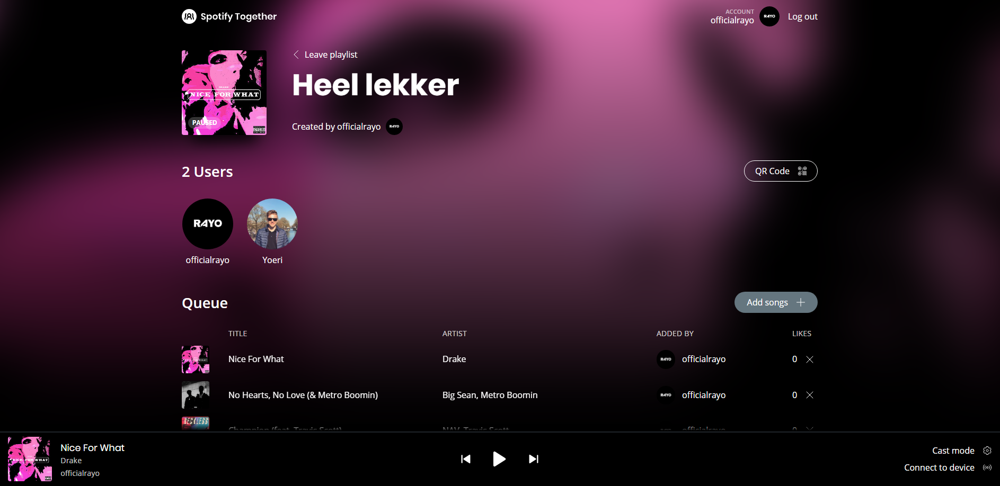
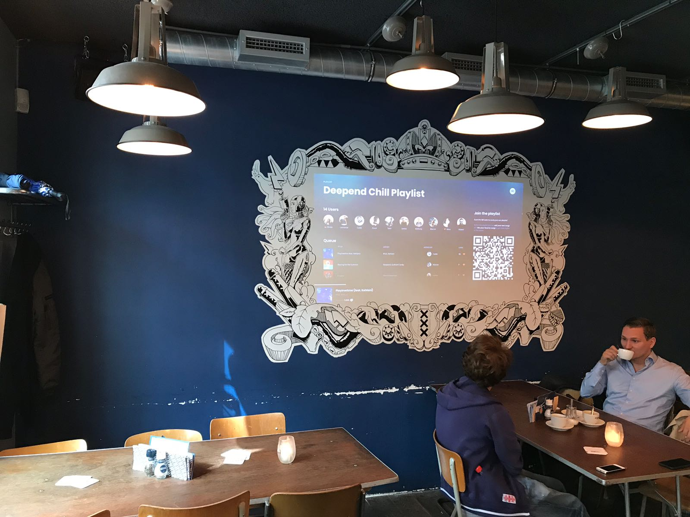
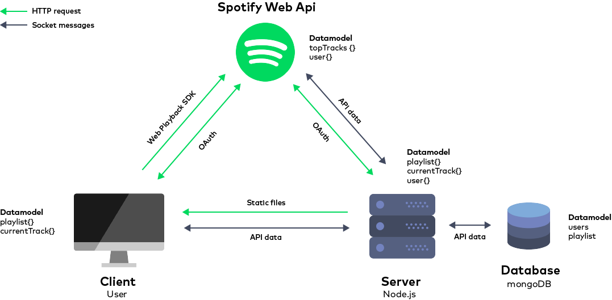

# Spotify Together



Link to prototype: https://spotifytogether.herokuapp.com/

## Problem

We both had the problem that there isn’t any solution right now for a synchronized playlist together with other people. Spotify themselves have their ‘collaborative playlists’ only then everyone had their own version of the playlist and everyone can play it separately. We wanted something synchronized, easily accessible where the opinion of the users counted.

## Concept

So we came up with Spotify Together. It’s an synchronized playlist where everyone can easily join in and add their favorite songs. Next, people can like songs they “like” to get them higher up the queue.

Spotify Together can be used both by small groups of friends or by businesses. In this case the business setting up their own playlist can change the restrictions so the songs being added to the playlist are monitored. How much freedom you give the users is completely up to the creators of the playlists.

## Café Fest

We pitched the concept to Café Fest which they really liked and they want to use our product when it’s finished. This also means I’m mostly focusing on the context within Café Fest and haven’t worked out the complete product. Otherwise the project would’ve become too big.

After a couple of meetings with Café Fest we noticed Spotify Together could be ideally used when Fest hosts special events. Let’s say Fest is throwing a disco party. They create their playlist, give it a suiting name, and add a restircction that only disco songs are allowed. That’s it. The playlist is made and can be casted to a beamer / monitor.

Next the guests walk into Fest, they see the beamer / monitor and know they can join the playlist. They scan the shown QR code and they are in. Now they can add they favorite songs and like songs to get them higher up the queue.


## The stakeholders

#### Spotify

We’re using their API and have to make sure we follow the attached rules.

#### Fest

A business who’s creating playlists and using the product in their business.

#### Creators of the playlists

Someone who’s created a playlist but isn’t a business, for example for their party. (We're not focusing on this stakeholder within this assignment.)

#### Users

The users who are joining the playlist and using the product.


## Devices

### Desktop

This one was pretty straightforward. The desktop is focused on the creators of the playlists, so in this case Fest. They are able to modify all the settings on the desktop to create their ideal playlists. On the desktop the creator can remove songs, change the settings and accept or reject requested songs (more on this later).

### Beamer

Also known as “the bridge”. The beamer figuratively forms the bridge between the desktop and mobile. When the playlist is created on the desktop they can cast their screen to a beamer where a neat visual is shown to all the guests of Fest. The difference between the beamer and the desktop are their purposes, the beamer communicates what is happening in the playlist to the users. The desktop main purpose is to support the creator with their actions.

### Smartphone

Also, straightforwards. This is the device 99% of the users are going to be using. When the users see the beamer they can scan the displayed QR code and join the playlist within seconds. On their smartphone they can like songs in the playlist and add they favorite songs from their own Spotify account.


## Context
1. A global playlist at a party with friends and strangers. Everyone can easily join and manage the global playlist.
2. A global playlist at a café where the customers can add songs and like songs from the playlist. The choice of songs to be added to the playlist can contain rules decided by the café. For example only ‘Jazz’ songs or only songs from before 1900.

## User needs
1. The user wants to create a global playlist in which people can easily join.
2. Users want to like their favorite song to get it higher up the queue.
3. Users want to manage the playlist by adding / removing / skipping songs without abuse.
4. Limit the choice of songs to be added to the playlist

## Flow
A user walks into Café Fest, sees the beamer and knows he can add songs himself to their playlist. He opens his smartphone, scans the QR on the beamer and joins the playlist. He adds a song, sees it receives likes from other and gets to be higher up the queue. The next song he adds, doesn’t meet the playlists requirements but he can still request the song to the admin. At the end of the event he walks away and receives a notification with some statistics of the event. He is also asked to save the playlist to his own Spotify account so he can listen to it again on his own.

## Context & User test

In the middle of the development process we tested the context in Fest by using the beamer and connecting different devices. After testing the context we also saw a group of people drinking / enjoying their time at Fest. So we felt like it was a great opportunity to pitch them our idea and have a discussion about it. Funny enough they were all studying law and could give us some new insights in that field. They also did like the general idea very much. Below are all the insights we got from both the meeting with Café Fest and the discussion with the group.



### Insights

1. Higher contrast (maybe changing the contrast based on time?)
2. Add track limit, able to add 3 tracks per hour
3. Changing the name (more general, no Spotify in it)
4. Maybe being able to quickly change to another playlist (automatically based on time)
5. Receive a like to give away when you order a beer, or maybe being able to add another song by ordering products at Fest?
6. QR codes on posters
7. Link to playlist under the QR on the beamer
8. Being able to vote within a time schedule. So once every hour everyone can vote for their favorite song
9. Maybe add an onboarding screen to explain the steps (after qr scan?)

## MoSCoW

### Must have
- [x] Users can search for tracks.
- [x] User can see their own playlists / groups (difficult)
- [x] Functionality where users can create and join rooms.
- [x] See who's online.
- [x] See who added a new track to the current playlist.
- [x] Checking for duplicate tracks.
- [x] Likes to manage the queue, the more likes a song gets the higher it will be

### Should have

- [x] QR to join a group
- [x] Real time sync the position of the current playing track for all clients. (difficult)
- [ ] Limit the songs which can be chosen to be added. To particular songs or genre.
- [x] Songs with the highest rating will be placed on top of the queue. So people can like songs to let them play quicker.
- [ ] People will be rated based on the likes they receive on their added songs. Maybe a nice visual cue to indicate this?
- [ ] A warning to let people know there is already a song playing to not accidentally skip to current playing song.
- [ ] Settings for player controls (pause / play / skip / shuffle). On or Off. Off means only the creator of the group can control the player. On means everyone can. If the creator / admin leaves the person with the most points will become creator / admin.

### Could have
- [ ] Voting for skipping a song. Amount of needed votes depends on the amount of total users in the group
- [ ] Cast button within the interface on Chrome
- [ ] Personalize the playlists for companies. Custom fonts, colors, images.
- [ ] Ask for admin permission.
- [ ] Save playlist in Spotify for later
- [ ] Automatically add similar songs to the playlist when empty
- [ ] Give user admin rights
- [ ] When it’s someone birthday, the track “Happy Birthday” will be added to the playlist
- [ ] Vote to skip
- [ ] Request a song outside of the custom rules which the admin can drag to the playlist
- [ ] When the user likes a song, he / she can choose between multiple emoji’s which will be popping up in de beamer screen.
- [ ] Feedback button for the users. So they can quickly give feedback. Like invision feedback button in their beta.

### Wont have
- [ ] Spotify Together for companies. Making revenue by buying features. For example your songs will be directly on top of the queue if you’re premium. If a bar is making a premium group? People in it who are premium will pay a fee towards the company.
- [ ] Groups of premium users will exist. Groups of non-paid users will be removed after 24? hours.
- [ ] Adding multiple music streaming services, e.g. Soundcloud?
- [ ] Giving companies a different interface for their group / playlist. They can see what music type users add the most to their playlist etc.. To summarize: offer more data about the users in their group / playlist.
- [ ] QR codes on menu cart or cups to join playlist in cafe. For every drink points to add a new song?

## Applied subjects from Webdev minor

### CSS to the rescue
- The application has a pleasurable interface that suits the needs of the user.
- The application uses a responsive solution for the interface that works on every screen size.
- The interface is designed with attention to detail.

### Webapp from scratch
- The application gets data from an API which gets manipulated and shown in the application.
- Clientside interaction of the application is added with Javascript.

### Real-Time Web
- The application is a Node Web App which consumes an external data source through an API and serves a frontend using routing and templating techniques.
- The application is a live web application which reflects changes to the back-end data model in reactive front-end views, using real-time messaging technologies with sockets.
- The project is described in a professional readme with insightful diagrams showing the life cycle of the data.


### Web design
- The usability of the application is tested and improved.
- The application has different user needs which are correctly implemented to get a good UX.
- The User Goals and User Stories are described this consist of what the user want and in which context.
- The interface of the application has a certain flow where the user easily can reach his goal.

## Getting started

1.  Clone the repo `git clone`.
2.  Install dependencies `npm install`.
3.  Run `npm start` to start server on port 3000.

## Features
There are different rights of users and admins. Admins have the more functionality as users but these are additional on the basic functionality. Here you can see the difference in what features they can use.

### Users
- Create a playlist.
- Join a playlist.
- See all active users inside a playlist.
- Add tracks to the playlist.
- Like songs in the playlist.
- Remove your own added songs
- Get information about the currently playing track.

### Admins
- Real time sync player on all connected devices.
- Remove all songs.
- Control the player.
- Change settings of the playlist.
- Set cast mode.

## Setting up Node.js & Express

To get my project running I've started with `npm init` to initialize a `package.json`. From there I started to set-up a `Node.js` directory structure and starting to add different dependencies like `Express` for static file serving and templating.

## Data
This application uses the `Spotify Web Api` as external data source. With this API, my application can retrieve Spotify content such as album data and playlists. To access user-related data through the Web API, an application must be authorized by the user to access that particular information. When the user connect with my application his user data gets fetched to my server and saved in a database. Based on this particular user, more data about his favorite tracks gets loaded and emitted to the client.

### Database system
This application uses mongoDB as database system with mongoose as schema-based model for application data. The database consist the users and a playlist.  When the user connect with my application the server checks if there already is an user present. If so send data from the database, else save that user in the database. Also the playlist is served from the database. When a user adds a playlist, the database gets updated and sets an object with the default properties of a playlist.

### Data life cycle
This is the data model of the application. It shows the communication between the major components of the app.



## Authorization
To access user-related data through the Spotify Web API, my application must be authorized by the user to access particular user information. For authorization within my app I've used `passport.js`. This is an authentication middleware for Node.js with different Authentication mechanisms, known as strategies. I used the Passport strategy for authenticating with Spotify using the OAuth 2.0 API. Following this example [https://github.com/jmperez/passport-spotify#readme](https://github.com/jmperez/passport-spotify#readme)

## Deployment

I've deployed my application by using `Heroku`. This was pretty easy to setup. Steps that I took:

1.  Signed in with an existing `Heroku` account.
2.  Added a new application.
3.  Chose `GitHub` as deployment method.
4.  Connected heroku to the `git repo` .
5.  App was running on [https://spotify-together.herokuapp.com/](https://spotify-together.herokuapp.com/)
6.  Added my environment varialbles to heroku to get the connection with the database working.

Then I needed to change a few things to get the app working. First changed this line in my `app.js`

from:

```javascript
server.listen(8888, function() {
    console.log('server is running on port 8888');
});
```

to:
```javascript
server.listen(process.env.PORT || 8888, function() {
    console.log('server is running on port:8888');
});
```

This because Heroku assigns the port for you, so you can't set your own. You need to have read in the port number from the PORT environment variable. In this case it would be the `process.env.PORT` variable. [Source](https://stackoverflow.com/questions/43944929/how-to-listen-on-any-port-on-heroku-when-a-web-port-80-is-already-in-use)

Lastly I needed to add my environment variables to Heroku because they're not commited trough Github. This file contains the Spotify Api credentials and database login credentials. I added them mannualy in the heroku settings of the app. Then the server started running.

## Built With

- [Node.js](https://nodejs.org/en/) -  Server framework
- [Express](https://expressjs.com/) -  Static file serving/templating
- [EJS](http://ejs.co/) - Templating language
- [socket.io](https://socket.io/) -  Real-time engine
- [Spotify Web Api](https://developer.spotify.com/web-api/) -  Access Spotify Web Api data
- [Spotify Web Playback SDK](https://beta.developer.spotify.com/documentation/web-playback-sdk/quick-start/) - Play Spotify audio inside browser
- [Pasport.js](http://www.passportjs.org/) - Authentication middleware for Node.js

## License

MIT © Yoeri Pasmans & Leon van Zijl
